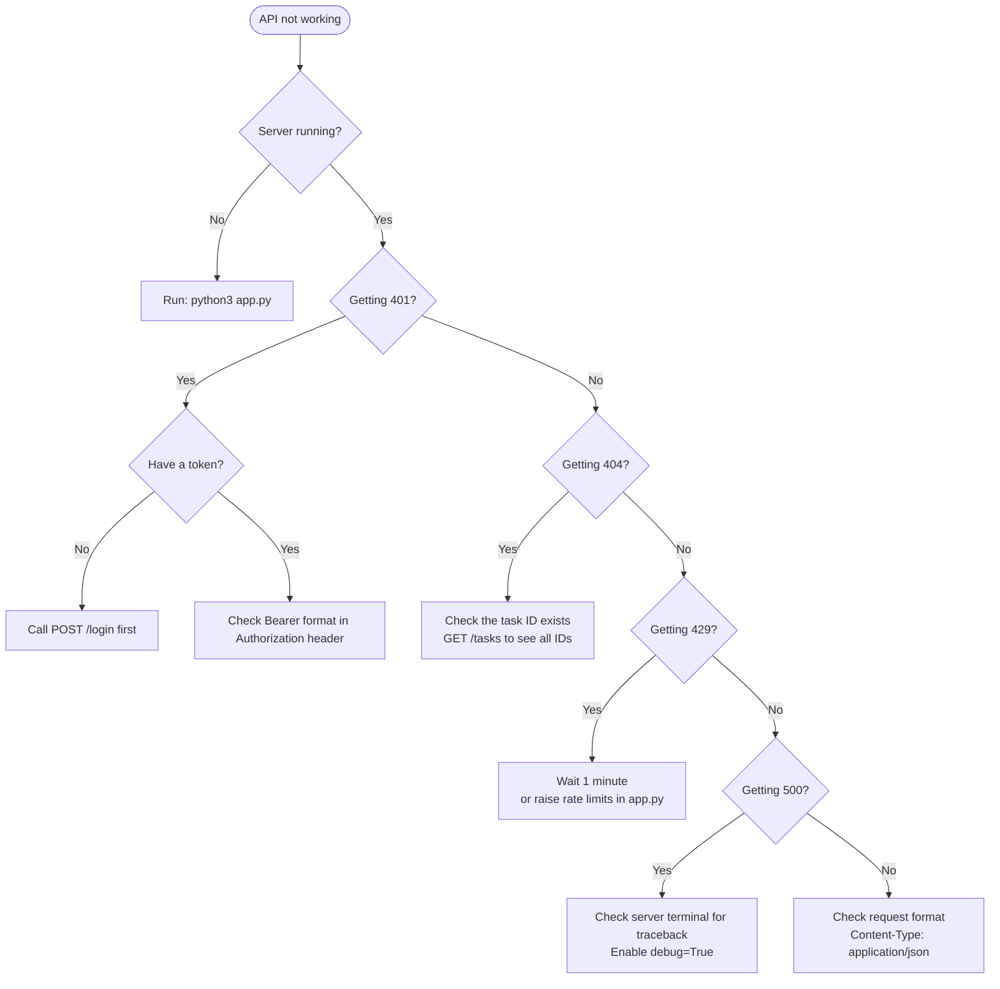

# Flask To-Do API — Complete Setup & Execution Guide

> **Audience:** Someone who has never seen this repository before.
> **Goal:** Get the API running, test it, debug it, and understand how to maintain it.

---

## Table of Contents

1. [Requirements and Prerequisites](#1-requirements-and-prerequisites)
2. [Operating System Requirements](#2-operating-system-requirements)
3. [Step 1 — Clone or Access the Repository](#3-step-1--clone-or-access-the-repository)
4. [Step 2 — Set Up the Python Virtual Environment](#4-step-2--set-up-the-python-virtual-environment)
5. [Step 3 — Install Dependencies](#5-step-3--install-dependencies)
6. [Step 4 — Configure Environment Variables](#6-step-4--configure-environment-variables)
7. [Step 5 — Database Setup](#7-step-5--database-setup)
8. [Step 6 — Run the API (Development Mode)](#8-step-6--run-the-api-development-mode)
9. [Step 7 — Test the API](#9-step-7--test-the-api)
10. [Production Deployment](#10-production-deployment)
11. [Docker Setup](#11-docker-setup)
12. [Linting and Formatting](#12-linting-and-formatting)
13. [Debugging Techniques](#13-debugging-techniques)
14. [Common Errors and Solutions](#14-common-errors-and-solutions)
15. [Troubleshooting Reference](#15-troubleshooting-reference)
16. [Maintenance Recommendations](#16-maintenance-recommendations)
17. [Update and Upgrade Procedures](#17-update-and-upgrade-procedures)

---

## 1. Requirements and Prerequisites

### Software You Need Installed

| Software | Minimum Version | How to Check |
|----------|----------------|--------------|
| Python | 3.10+ | `python3 --version` |
| pip | 21+ | `pip3 --version` |
| git | Any | `git --version` |
| curl *(optional)* | Any | `curl --version` |

### Knowledge Prerequisites

- Basic Python (functions, classes, imports)
- Basic command-line usage (cd, ls, running scripts)
- Basic understanding of HTTP (optional but helpful)

---

## 2. Operating System Requirements

| OS | Status | Notes |
|----|--------|-------|
| Ubuntu 20.04+ / Debian | Fully supported | All instructions below use this |
| macOS 12+ | Supported | Replace `apt` with `brew` |
| Windows 10/11 | Supported with adjustments | Use WSL2 or replace `/` paths with `\` |
| Any Linux | Supported | Install Python 3.10+ from your package manager |

---

## 3. Step 1 — Clone or Access the Repository

If you have the files already (as in this repository), navigate to the project:

```bash
cd /home/holberton/Documents/Holberton-PLDs/HBTN-PLDS/Cohort25/4.RESTful_API
```

If starting from git:

```bash
git clone <repository-url>
cd 4.RESTful_API
```

Verify you can see the project layout:

```bash
ls -la
# Expected output:
# drwxrwxr-x  env/
# drwxrwxr-x  flask_todo_api/
```

---

## 4. Step 2 — Set Up the Python Virtual Environment

A virtual environment isolates this project's packages from your system Python, preventing version conflicts.

### Option A — Use the Existing `env/` (Already Present)

The `env/` directory in this repo contains a pre-built virtual environment for Python 3.12. Activate it:

```bash
# From the 4.RESTful_API/ directory
source env/bin/activate
```

You will see your prompt change to include `(env)`:

```
(env) holberton@machine:~/...4.RESTful_API$
```

To deactivate the virtual environment when done:

```bash
deactivate
```

### Option B — Create a Fresh Virtual Environment

If the existing `env/` doesn't work on your machine (different Python version, different OS), create a new one:

```bash
# Ensure you are in 4.RESTful_API/
python3 -m venv env
source env/bin/activate
```

---

## 5. Step 3 — Install Dependencies

> **Important:** The `requirement.txt` file in this project is currently **empty**. You must install the packages manually.

With the virtual environment active:

```bash
pip install flask flask-sqlalchemy flask-jwt-extended flask-limiter flask-cors requests
```

### What Each Package Does

| Package | Why It's Needed |
|---------|----------------|
| `flask` | The web framework |
| `flask-sqlalchemy` | Database ORM integration |
| `flask-jwt-extended` | JWT token creation and validation |
| `flask-limiter` | Rate limiting middleware |
| `flask-cors` | CORS header management |
| `requests` | HTTP client used in the test script |

### Populate the Requirements File (Recommended)

After installing, save the exact versions so future users can reproduce the environment:

```bash
pip freeze > flask_todo_api/requirement.txt
```

### Verify Installation

```bash
python3 -c "import flask, flask_sqlalchemy, flask_jwt_extended, flask_limiter, flask_cors, requests; print('All packages OK')"
```

Expected output:
```
All packages OK
```

---

## 6. Step 4 — Configure Environment Variables

### Current State (Development — Insecure)

The app currently uses a hardcoded JWT secret in `app.py`:

```python
app.config["JWT_SECRET_KEY"] = "supersecretkey"
```

This is acceptable for local development only.

### Recommended Configuration

For any shared or production environment, move secrets to environment variables:

```bash
# Set before running the app
export JWT_SECRET_KEY="$(python3 -c 'import secrets; print(secrets.token_hex(32))')"
export FLASK_ENV=development
```

Then update `app.py`:

```python
import os
app.config["JWT_SECRET_KEY"] = os.environ.get("JWT_SECRET_KEY", "fallback-dev-only-key")
```

### Environment Variables Reference

| Variable | Description | Default (unsafe) |
|----------|-------------|------------------|
| `JWT_SECRET_KEY` | Signs and verifies JWT tokens | `"supersecretkey"` |
| `FLASK_ENV` | `development` or `production` | Not set |
| `FLASK_DEBUG` | `1` enables debug mode | Not set |
| `DATABASE_URL` | Database connection string | `sqlite:///tasks.db` |

---

## 7. Step 5 — Database Setup

### Automatic Setup

The database creates itself automatically when the app first runs. No manual setup is required.

This line in `app.py` handles it:

```python
with app.app_context():
    db.create_all()  # Creates all tables if they don't exist
```

The SQLite database file will be created at:

```
flask_todo_api/instance/tasks.db
```

### Manual Database Inspection

To inspect the database without starting the app:

```bash
python3 -c "
import sqlite3
conn = sqlite3.connect('flask_todo_api/instance/tasks.db')
cursor = conn.cursor()
cursor.execute(\"SELECT name FROM sqlite_master WHERE type='table'\")
print('Tables:', cursor.fetchall())
cursor.execute('SELECT * FROM task')
print('Tasks:', cursor.fetchall())
conn.close()
"
```

### Reset the Database

To start with a fresh, empty database:

```bash
rm flask_todo_api/instance/tasks.db
# The next app startup will recreate it
```

---

## 8. Step 6 — Run the API (Development Mode)

### Start the Server

```bash
# Make sure you are in the flask_todo_api/ directory
cd flask_todo_api

# With virtual environment active
python3 app.py
```

### Expected Output

```
 * Serving Flask app 'app'
 * Debug mode: on
WARNING: This is a development server. Do not use it in a production deployment.
 * Running on http://127.0.0.1:5000
Press CTRL+C to quit
 * Restarting with stat
 * Debugger is active!
 * Debugger PIN: 123-456-789
```

The API is now live at `http://127.0.0.1:5000` (also written as `http://localhost:5000`).

### Quick Verification

Open a new terminal and run:

```bash
curl http://localhost:5000/tasks
```

Expected response:

```json
[]
```

(Empty array — no tasks yet.)

### Development Mode Features

With `debug=True`:
- **Auto-reload**: The server restarts automatically when you save `app.py`
- **Interactive debugger**: If an unhandled exception occurs, you get a browser-based debugger
- **Detailed error messages**: Full stack traces in the response

---

## 9. Step 7 — Test the API

### Option A — Run the Automated Test Script

Open a second terminal (keep the server running in the first), activate the virtual environment, and run:

```bash
cd flask_todo_api
python3 test_api.py
```

Expected output (first run):

```
[PASS] User registered successfully.
[PASS] Login successful. Token received.
[PASS] Retrieved tasks successfully.
Tasks: []
[PASS] Task created successfully. ID: 1
[PASS] Retrieved tasks successfully.
Tasks: [{'id': 1, 'title': 'Learn Flask', 'completed': False}]
[PASS] Task updated successfully.
[PASS] Retrieved tasks successfully.
Tasks: [{'id': 1, 'title': 'Learn Flask & Swagger', 'completed': True}]
[PASS] Task deleted successfully.
[PASS] Retrieved tasks successfully.
Tasks: []
```

On second run (user already exists):

```
[INFO] User already exists, skipping registration.
[PASS] Login successful. Token received.
...
```

### Option B — Manual Testing with curl

**1. Register a user:**

```bash
curl -X POST http://localhost:5000/register \
  -H "Content-Type: application/json" \
  -d '{"username": "alice", "password": "mypassword"}'
```

Response:
```json
{"message": "User registered successfully"}
```

**2. Login and capture the token:**

```bash
TOKEN=$(curl -s -X POST http://localhost:5000/login \
  -H "Content-Type: application/json" \
  -d '{"username": "alice", "password": "mypassword"}' \
  | python3 -c "import sys, json; print(json.load(sys.stdin)['token'])")

echo "Token: $TOKEN"
```

**3. Create a task:**

```bash
curl -X POST http://localhost:5000/tasks \
  -H "Authorization: Bearer $TOKEN" \
  -H "Content-Type: application/json" \
  -d '{"title": "Buy groceries"}'
```

Response:
```json
{
    "id": 1,
    "title": "Buy groceries",
    "completed": false
}
```

**4. Get all tasks:**

```bash
curl http://localhost:5000/tasks
```

**5. Update a task (mark as complete):**

```bash
curl -X PUT http://localhost:5000/tasks/1 \
  -H "Authorization: Bearer $TOKEN" \
  -H "Content-Type: application/json" \
  -d '{"completed": true}'
```

**6. Delete a task:**

```bash
curl -X DELETE http://localhost:5000/tasks/1 \
  -H "Authorization: Bearer $TOKEN"
```

### Option C — Test with Postman

1. Download and install [Postman](https://www.postman.com/)
2. Create a new collection called "Flask Todo API"
3. Add each endpoint as a request
4. For authenticated routes, go to **Authorization** tab → Type: **Bearer Token** → paste your token

---

## 10. Production Deployment

> The development server is **not suitable** for production. Use gunicorn + nginx.

### Install Production Dependencies

```bash
pip install gunicorn
```

### Run with Gunicorn

```bash
cd flask_todo_api

# 4 worker processes, binding to all interfaces on port 8000
gunicorn -w 4 -b 0.0.0.0:8000 app:app
```

The `app:app` means: from the file `app.py`, use the object named `app`.

### Production Environment Variables

```bash
export JWT_SECRET_KEY="$(python3 -c 'import secrets; print(secrets.token_hex(32))')"
export FLASK_ENV=production
```

### Nginx Reverse Proxy (Recommended)

Install nginx and create a configuration at `/etc/nginx/sites-available/flask-todo`:

```nginx
server {
    listen 80;
    server_name yourdomain.com;

    location / {
        proxy_pass http://127.0.0.1:8000;
        proxy_set_header Host $host;
        proxy_set_header X-Real-IP $remote_addr;
        proxy_set_header X-Forwarded-For $proxy_add_x_forwarded_for;
    }
}
```

Enable and reload:

```bash
sudo ln -s /etc/nginx/sites-available/flask-todo /etc/nginx/sites-enabled/
sudo nginx -t
sudo systemctl reload nginx
```

### Production Checklist

- [ ] `debug=False` in app.py or set via environment
- [ ] `JWT_SECRET_KEY` is a random 256-bit value from an environment variable
- [ ] HTTPS configured (use Let's Encrypt / Certbot)
- [ ] Using gunicorn or uWSGI, not Flask's built-in server
- [ ] Database is PostgreSQL, not SQLite (for multi-user load)
- [ ] Rate limiter uses Redis backend (not in-memory)
- [ ] Passwords are hashed (not stored in plain text)

---

## 11. Docker Setup

The project does not include a `Dockerfile`, but here is a complete setup you can add.

### Create `Dockerfile` in `flask_todo_api/`

```dockerfile
FROM python:3.12-slim

WORKDIR /app

COPY requirement.txt .
RUN pip install --no-cache-dir -r requirement.txt

COPY . .

ENV JWT_SECRET_KEY=changeme_use_a_real_secret
ENV FLASK_ENV=production

EXPOSE 8000

CMD ["gunicorn", "-w", "4", "-b", "0.0.0.0:8000", "app:app"]
```

### Create `docker-compose.yml` in `4.RESTful_API/`

```yaml
version: "3.8"

services:
  api:
    build: ./flask_todo_api
    ports:
      - "8000:8000"
    environment:
      - JWT_SECRET_KEY=${JWT_SECRET_KEY}
    volumes:
      - db_data:/app/instance

volumes:
  db_data:
```

### Build and Run

```bash
# First, populate requirement.txt
cd flask_todo_api
source ../env/bin/activate
pip freeze > requirement.txt
cd ..

# Set the secret
export JWT_SECRET_KEY="$(python3 -c 'import secrets; print(secrets.token_hex(32))')"

# Build and start
docker-compose up --build

# Run in background
docker-compose up -d

# View logs
docker-compose logs -f

# Stop
docker-compose down
```

---

## 12. Linting and Formatting

The project does not include linting configuration. Here is how to add it.

### Install Tools

```bash
pip install flake8 black isort
```

### Run Linter (Flake8)

```bash
cd flask_todo_api
flake8 app.py test_api.py --max-line-length=100
```

### Auto-Format (Black)

```bash
black app.py test_api.py
```

### Sort Imports (isort)

```bash
isort app.py test_api.py
```

### Recommended: Add a `Makefile`

Create `flask_todo_api/Makefile`:

```makefile
lint:
	flake8 app.py test_api.py --max-line-length=100

format:
	black app.py test_api.py
	isort app.py test_api.py

test:
	python3 test_api.py

run:
	python3 app.py
```

Usage:

```bash
make run    # Start the API
make test   # Run tests
make lint   # Check code style
make format # Auto-format code
```

---

## 13. Debugging Techniques

### 1. Flask Debug Mode

Already enabled with `app.run(debug=True)`. When an exception occurs, the browser shows a full traceback. The interactive debugger allows you to execute Python in the browser at any stack frame.

> **Security warning:** Never use `debug=True` in production. The debugger can execute arbitrary code.

### 2. Print Debugging

Add print statements anywhere in the route handlers:

```python
def create_task():
    data = request.json
    print(f"[DEBUG] Received data: {data}")  # Appears in terminal
    ...
```

### 3. Flask Shell

Inspect the database interactively without running the server:

```bash
cd flask_todo_api
flask shell
```

Inside the shell:

```python
>>> from app import db, Task, User
>>> Task.query.all()
[<Task 1>, <Task 2>]
>>> Task.query.get(1).to_dict()
{'id': 1, 'title': 'Buy groceries', 'completed': False}
>>> User.query.count()
2
```

### 4. Inspect HTTP Requests

Add this to `app.py` temporarily to log every incoming request:

```python
@app.before_request
def log_request():
    print(f"[REQUEST] {request.method} {request.path}")
    print(f"[HEADERS] {dict(request.headers)}")
    if request.json:
        print(f"[BODY] {request.json}")
```

### 5. Inspect JWT Tokens

Decode a token without verifying it (for debugging only):

```python
import base64, json

def decode_token_parts(token):
    parts = token.split('.')
    # Add padding to base64
    payload = parts[1] + '=' * (4 - len(parts[1]) % 4)
    decoded = base64.urlsafe_b64decode(payload)
    print(json.loads(decoded))

decode_token_parts("eyJhbGciOiJIUzI1NiIsInR5cCI6IkpXVCJ9.eyJzdWIiOi...")
```

Or use the online tool at [jwt.io](https://jwt.io) (paste the token to inspect its payload).

---

## 14. Common Errors and Solutions

### Error: `ModuleNotFoundError: No module named 'flask'`

**Cause:** The virtual environment is not activated, or packages are not installed.

**Fix:**
```bash
source env/bin/activate
pip install flask flask-sqlalchemy flask-jwt-extended flask-limiter flask-cors
```

---

### Error: `Address already in use` (Port 5000)

**Cause:** Another process is using port 5000.

**Fix:**
```bash
# Find what's using port 5000
lsof -i :5000

# Kill it (replace PID with the actual process ID)
kill -9 <PID>

# Or run Flask on a different port
python3 app.py --port=5001
# (or set port in app.run)
```

---

### Error: `401 Unauthorized` when calling a protected route

**Cause:** Missing or invalid `Authorization` header.

**Fix:** Include the header in your request:
```bash
curl -H "Authorization: Bearer YOUR_TOKEN_HERE" http://localhost:5000/tasks
```

Ensure:
- The token was obtained from `/login` and is not expired
- The header format is exactly `Bearer <space> <token>`
- The `JWT_SECRET_KEY` has not changed since the token was issued

---

### Error: `429 Too Many Requests`

**Cause:** You've exceeded the rate limit for an endpoint.

**Fix:** Wait for the limit window to expire (1 minute for most endpoints). During development, you can temporarily raise the limit in `app.py`:

```python
default_limits=["1000 per hour"]
```

---

### Error: `sqlalchemy.exc.OperationalError: no such table`

**Cause:** The database tables haven't been created yet.

**Fix:** The `db.create_all()` call in `app.py` should handle this. Ensure it runs:

```python
with app.app_context():
    db.create_all()
```

If the database file is corrupted, delete it and restart:

```bash
rm flask_todo_api/instance/tasks.db
python3 flask_todo_api/app.py
```

---

### Error: `400 Bad Request — Username already exists`

**Cause:** You tried to register with a username that's already in the database.

**Fix:** Use a different username, or delete the database to reset all users.

---

### Error: `TypeError: Object of type Task is not JSON serializable`

**Cause:** You returned a SQLAlchemy model object directly to `jsonify()` without calling `to_dict()`.

**Fix:**
```python
# Wrong
return jsonify(task)

# Correct
return jsonify(task.to_dict())
```

---

### Error: Test script fails with `ConnectionRefusedError`

**Cause:** The Flask server is not running when `test_api.py` is executed.

**Fix:** Start the server in one terminal, then run the test script in a second terminal:

```bash
# Terminal 1
python3 flask_todo_api/app.py

# Terminal 2
python3 flask_todo_api/test_api.py
```

---

## 15. Troubleshooting Reference



---

## 16. Maintenance Recommendations

### Daily

- Monitor server logs for errors (in production, use a log aggregator)
- Check rate limit hit rates — a spike may indicate an attack

### Weekly

- Review database size: `ls -lh flask_todo_api/instance/tasks.db`
- Check for failed authentication attempts in logs

### Monthly

- Rotate the `JWT_SECRET_KEY` (forces all users to log in again)
- Review and update dependencies: `pip list --outdated`
- Back up the database file

### Before Any Code Change

```bash
# Check current tests still pass
python3 flask_todo_api/test_api.py

# Check for syntax errors
python3 -m py_compile flask_todo_api/app.py && echo "Syntax OK"
```

---

## 17. Update and Upgrade Procedures

### Update a Single Package

```bash
source env/bin/activate
pip install --upgrade flask
```

### Update All Packages

```bash
source env/bin/activate
pip list --outdated
pip install --upgrade flask flask-sqlalchemy flask-jwt-extended flask-limiter flask-cors
```

### After Updating — Regenerate Requirements File

```bash
pip freeze > flask_todo_api/requirement.txt
```

### Upgrade Python Version

1. Create a new virtual environment with the new Python:
   ```bash
   python3.13 -m venv env_new
   source env_new/bin/activate
   ```
2. Install packages into the new environment:
   ```bash
   pip install -r flask_todo_api/requirement.txt
   ```
3. Run the tests to verify:
   ```bash
   python3 flask_todo_api/app.py &
   sleep 2
   python3 flask_todo_api/test_api.py
   kill %1
   ```
4. If all tests pass, replace the old environment:
   ```bash
   rm -rf env
   mv env_new env
   ```

### Database Schema Changes

If you add or change a model field after the database already exists, `db.create_all()` will **not** update existing tables. You have two options:

**Option A — Development (destructive):** Delete the database and let it recreate:
```bash
rm flask_todo_api/instance/tasks.db
```

**Option B — Production (safe):** Use Flask-Migrate for schema migrations:
```bash
pip install flask-migrate
```

Then in `app.py`:
```python
from flask_migrate import Migrate
migrate = Migrate(app, db)
```

```bash
flask db init      # One-time setup
flask db migrate   # Generate migration file from model changes
flask db upgrade   # Apply migration to the database
```

---

## Quick Reference Card

```
ACTIVATE ENV:   source env/bin/activate
START SERVER:   cd flask_todo_api && python3 app.py
RUN TESTS:      python3 flask_todo_api/test_api.py
FLASK SHELL:    cd flask_todo_api && flask shell
RESET DB:       rm flask_todo_api/instance/tasks.db
DEACTIVATE:     deactivate

API BASE URL:   http://localhost:5000

ENDPOINTS:
  GET    /tasks           → list all tasks (no auth)
  POST   /tasks           → create task (needs token)
  PUT    /tasks/<id>      → update task (needs token)
  DELETE /tasks/<id>      → delete task (needs token)
  POST   /register        → create account
  POST   /login           → get JWT token
```
