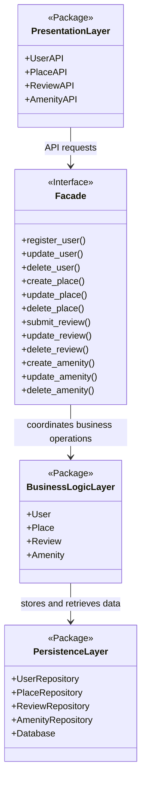

# High-Level Package Diagram

## Objective

The objective of this task is to create a high-level package diagram for the HBnB Evolution application. The diagram represents the three main architectural layers of the system and shows how they communicate through the facade pattern.

The application follows a layered architecture composed of:

- Presentation Layer
- Business Logic Layer
- Persistence Layer

The facade pattern is used as a simplified interface between the Presentation Layer and the Business Logic Layer, allowing API services to access the core application logic without directly depending on the internal models.

---

# High-Level Package Diagram



---

# Layer Descriptions

## Presentation Layer

The Presentation Layer contains the services and API endpoints exposed to users. This layer is responsible for handling client requests and returning responses.

Its responsibilities include:

- Receiving HTTP/API requests
- Validating incoming request data
- Sending responses back to clients
- Communicating with the facade interface

Examples of components in this layer include:

- `UserAPI`
- `PlaceAPI`
- `ReviewAPI`
- `AmenityAPI`

This layer does not directly interact with the database or business entities.

---

## Facade Interface

The Facade acts as a unified communication interface between the Presentation Layer and the Business Logic Layer.

Instead of allowing API endpoints to directly manipulate business models, the facade centralizes all major application operations into simplified methods.

Examples include:

- `register_user()`
- `create_place()`
- `submit_review()`
- `create_amenity()`

The facade pattern improves the architecture by:

- Reducing coupling between layers
- Simplifying interactions
- Improving maintainability
- Providing a centralized access point for business operations

---

## Business Logic Layer

The Business Logic Layer contains the core models and business rules of the HBnB application.

The main entities represented in this layer are:

- `User`
- `Place`
- `Review`
- `Amenity`

Responsibilities of this layer include:

- Enforcing business rules
- Managing relationships between entities
- Processing application logic
- Coordinating data operations with the persistence layer

Examples of business rules include:

- A place must belong to a user
- A review must be associated with both a user and a place
- Places may contain multiple amenities

---

## Persistence Layer

The Persistence Layer handles all database operations.

Its responsibilities include:

- Saving data
- Retrieving data
- Updating records
- Deleting records
- Managing database communication

This layer contains repository or data access components such as:

- `UserRepository`
- `PlaceRepository`
- `ReviewRepository`
- `AmenityRepository`

The Persistence Layer isolates database logic from the rest of the application, making the system easier to maintain and modify.

---

# Communication Flow

The communication flow between layers follows this structure:

```text
Client Request
      ↓
Presentation Layer
      ↓
Facade Interface
      ↓
Business Logic Layer
      ↓
Persistence Layer
      ↓
Database
```

Example flow for creating a place:

1. A user sends a request to create a place.
2. The `PlaceAPI` receives the request.
3. The API communicates with the facade using `create_place()`.
4. The facade coordinates the creation of the `Place` object.
5. The Business Logic Layer validates business rules.
6. The Persistence Layer stores the new place in the database.
7. A response is returned to the client.

---

# Design Decisions

The layered architecture was chosen to clearly separate responsibilities within the application.

The facade pattern was implemented to:

- Simplify communication between layers
- Reduce direct dependencies
- Improve readability and maintainability
- Centralize application operations

This structure also supports future scalability because internal implementations can change without affecting the external API layer.

---

# Conclusion

This high-level package diagram provides a conceptual overview of the HBnB Evolution architecture.

The application is divided into three main layers:

- Presentation Layer
- Business Logic Layer
- Persistence Layer

The facade pattern serves as the communication bridge between the Presentation Layer and the Business Logic Layer, ensuring a clean and maintainable architecture.

This design establishes a strong foundation for the future implementation phases of the project.