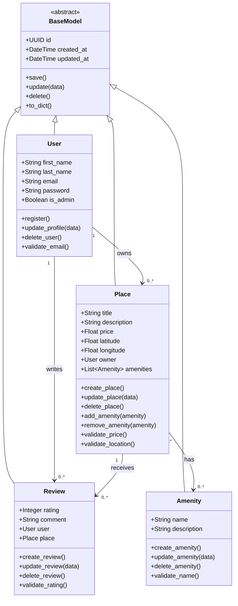

# Detailed Class Diagram for Business Logic Layer

## Objective

The objective of this task is to design a detailed UML class diagram for the Business Logic Layer of the HBnB Evolution application.

This diagram focuses on the main business entities of the system:

- `User`
- `Place`
- `Review`
- `Amenity`

The diagram includes each entity's attributes, methods, and relationships. It also shows how the entities inherit common behavior from a shared base class.

---

## Business Logic Layer Overview

The Business Logic Layer contains the core application models and rules. This layer is responsible for representing the main entities of the HBnB system and enforcing the rules that define how those entities interact.

All entities share common attributes such as:

- A unique identifier using UUID4
- A creation timestamp
- An update timestamp

To avoid repeating these attributes in every class, the diagram includes an abstract `BaseModel` class. Each main entity inherits from this base class.

---

## Detailed Class Diagram



---

## Entity Descriptions

## BaseModel

`BaseModel` is an abstract class that provides common attributes and methods for all business entities.

### Attributes

- `id`: A unique UUID4 identifier for each object.
- `created_at`: The date and time when the object was created.
- `updated_at`: The date and time when the object was last updated.

### Methods

- `save()`: Saves the object.
- `update(data)`: Updates the object with new data.
- `delete()`: Deletes the object.
- `to_dict()`: Converts the object into a dictionary representation.

Using a base class avoids duplication and ensures that all entities follow the same structure.

---

## User

The `User` class represents a user of the HBnB application. A user can be a regular user or an administrator.

### Attributes

- `first_name`: The user's first name.
- `last_name`: The user's last name.
- `email`: The user's email address.
- `password`: The user's password.
- `is_admin`: A boolean value that identifies whether the user is an administrator.

### Methods

- `register()`: Registers a new user.
- `update_profile(data)`: Updates the user's profile information.
- `delete_user()`: Deletes the user.
- `validate_email()`: Validates the email format.

### Business Rules

- Each user must have a unique ID.
- Each user must have an email.
- A user can own multiple places.
- A user can write multiple reviews.
- A user may be marked as an administrator using `is_admin`.

---

## Place

The `Place` class represents a property listed in the HBnB application.

### Attributes

- `title`: The title of the place.
- `description`: A description of the place.
- `price`: The price per night.
- `latitude`: The geographic latitude of the place.
- `longitude`: The geographic longitude of the place.
- `owner`: The user who created the place.
- `amenities`: A list of amenities associated with the place.

### Methods

- `create_place()`: Creates a new place.
- `update_place(data)`: Updates place information.
- `delete_place()`: Deletes a place.
- `add_amenity(amenity)`: Adds an amenity to the place.
- `remove_amenity(amenity)`: Removes an amenity from the place.
- `validate_price()`: Validates that the price is correct.
- `validate_location()`: Validates latitude and longitude.

### Business Rules

- Each place must have one owner.
- A user can own many places.
- A place can have many amenities.
- A place can receive many reviews.
- The price should be valid.
- Latitude and longitude should represent a valid location.

---

## Review

The `Review` class represents feedback left by a user for a specific place.

### Attributes

- `rating`: The numeric rating given to the place.
- `comment`: The written review comment.
- `user`: The user who wrote the review.
- `place`: The place being reviewed.

### Methods

- `create_review()`: Creates a new review.
- `update_review(data)`: Updates the review.
- `delete_review()`: Deletes the review.
- `validate_rating()`: Validates that the rating is within an accepted range.

### Business Rules

- Each review must be associated with one user.
- Each review must be associated with one place.
- A place can have multiple reviews.
- A user can write multiple reviews.
- The rating should follow the accepted rating scale.

---

## Amenity

The `Amenity` class represents a feature that can be associated with a place.

Examples of amenities include:

- WiFi
- Parking
- Pool
- Air conditioning

### Attributes

- `name`: The name of the amenity.
- `description`: A short description of the amenity.

### Methods

- `create_amenity()`: Creates a new amenity.
- `update_amenity(data)`: Updates amenity information.
- `delete_amenity()`: Deletes an amenity.
- `validate_name()`: Validates the amenity name.

### Business Rules

- Each amenity must have a unique ID.
- Each amenity has a name and description.
- A place can have multiple amenities.
- An amenity can be associated with multiple places.

---

# Relationship Explanation

## Inheritance

```text
BaseModel <|-- User
BaseModel <|-- Place
BaseModel <|-- Review
BaseModel <|-- Amenity
```

All main entities inherit from `BaseModel`.

This means `User`, `Place`, `Review`, and `Amenity` all share common attributes such as `id`, `created_at`, and `updated_at`.

---

## User and Place

```text
User "1" --> "0..*" Place : owns
```

One user can own zero or more places.

Each place belongs to exactly one user.

---

## User and Review

```text
User "1" --> "0..*" Review : writes
```

One user can write zero or more reviews.

Each review is written by exactly one user.

---

## Place and Review

```text
Place "1" --> "0..*" Review : receives
```

One place can receive zero or more reviews.

Each review belongs to exactly one place.

---

## Place and Amenity

```text
Place "0..*" --> "0..*" Amenity : has
```

A place can have multiple amenities.

An amenity can also be associated with multiple places.

This is a many-to-many relationship.

---

# Design Decisions

The class diagram was designed to reflect the main business rules of the HBnB Evolution application.

The use of `BaseModel` improves code organization by avoiding repeated attributes and methods across multiple classes.

The relationships between `User`, `Place`, `Review`, and `Amenity` represent the core behavior of the application:

- Users own places.
- Users write reviews.
- Places receive reviews.
- Places have amenities.

This design keeps the Business Logic Layer organized, reusable, and easy to extend in future implementation phases.

---

# Conclusion

This detailed class diagram provides a clear representation of the Business Logic Layer of the HBnB Evolution application.

It identifies the key entities, their attributes, methods, and relationships. It also includes inheritance through a shared base class and multiplicity between the entities.

This diagram will help guide the implementation of the models in the next phases of the project.